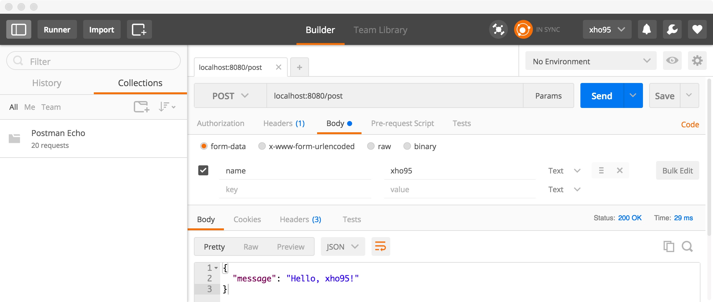

지난 번 파트에서 [Perfect](http://perfect.org/) 프레임웍을 사용하여 Swift 로 서버를 개발하는 방법을 알아보았습니다. [^perfect]

이번에는 이어서 [Server Side Swift with Perfect: Getting Started](https://videos.raywenderlich.com/screencasts/server-side-swift-with-perfect-getting-started) 동영상의 뒷 부분을 정리합니다. [^raywenderlich]

여기서 는 Router 와 JSON API  를 추가하고 POST 메소드를 다루는 방법을 설명합니다. 실제 영상에서도 설명을 많이하는 것이 아니라서 관련 설명은 적지만, 이 글을 보시는 분들은 코드를 통해서 충분히 기능을 이해할 수 있을 것입니다.

#### Router 추가하기

[Part 1](http://xho95.github.io/linux/swift/perfect/package/server/2017/03/06/Swift-with-Perfect-Part-1.html) [^part-1] 에서 만든 **main.swift** 에서 `server.documentRoot = "webroot"` 코드의 밑에 다음과 같은 코드를 추가합니다. 

```swift
var routes = Routes()

routes.add(method: .get, uri: "/", handler: {
	request, response in
	response.setBody(string: "Hello, Perfect!")
		.completed()
})

server.addRoutes(routes)
``` 

add 메소드의 handler 에는 클로져를 넘겨주고 있습니다.

빌드하고 실행합니다. [^started-swift] 브라우저에서 `localhost:8080/` 으로 접속하면 다음과 같이 나타나는 것을 볼 수 있습니다. 

```txt
Hello, Perfect!
```

이런 식으로 새로운 URI 를 추가할 수 있습니다.

#### JSON API 추가하기

앞서 추가해 준 코드의 `server.addRoutes(routes)` 앞에 아래의 코드를 작성합니다.

```swift
func returnJSONMessage(message: String, response: HTTPResponse) {
	do {
		try response.setBody(json: ["message": message])
			.setHeader(.contentType, value: "application/json")
			.completed()
	} catch {
		response.setBody(string: "Error handling request: \(error)")
			.completed(status: .internalServerError)
	}
}

routes.add(method: .get, uri: "/hello", handler: {
	request, response in 
	returnJSONMessage(message: "Hello, JSON!", response: response)
})
```

JSON API 의 경우 먼저 JSON 을 response 에 담아주는 함수부터 정의한 후 특정 URI 로 접속하면 이 함수를 호출하여 JSON 을 반환하도록 하고 있습니다.

빌드하고 실행해 봅니다. 브라우저에서 `localhost:8080/hello` 로 접속하면 다음과 같은 결과를 볼 수 있습니다. 

```txt
{"message":"Hello, JSON!"}
```

또 다른 JSON API 는 다음과 같이 하위 주소도 추가하여 원하는 만큼 만들 수 있습니다. 아래의 코드를 바로 위의 코드 바로 밑에 추가해 줍니다.

```swift
routes.add(method: .get, uri: "/hello/there", handler: {
  request, response in
  returnJSONMessage(message: "I'm tired of saying hello!", response: response)
})
```

실행 결과는 직접 확인해 보도록 합니다.

#### 매개 변수를 받아서 JSON 으로 출력하기

이전에 추가한 코드 밑에 아래의 코드를 더 추가합니다. `uri` 를 통해서 매개 변수를 받는 방법으로 중괄호를 사용하고 있음을 알 수 있습니다. 

아래 예제에서는 `guard` 문을 사용하여 해당 매개 변수의 값에 문제가 있거나 정수로 변환할 수 없는 경우 JSON 대신에 에러 메시지를 출력하도록 합니다.

```swift
routes.add(method: .get, uri: "/beers/{num_beers}", handler: {
  request, response in
  guard let numBeersString = request.urlVariables["num_beers"], let numBeersInt = Int(numBeersString) else {
    response.completed(status: .badRequest)
    return
  }

  returnJSONMessage(message: "Take one down, pass it around, \(numBeersInt - 1) bottles of beer on the wall...", response: response)
})
```

매개 변수가 잘못되었을 때의 결과는 다음과 같습니다. 

```txt
The file /beers/index.html was not found.
```

#### POST 수행하기

마지막으로 HTTP 메소드 중에서 GET 이 아니라 POST 메소드를 다루는 방법입니다. 

다음의 코드를 위의 코드 바로 밑에 넣어줍니다.

```swift
routes.add(method: .post, uri: "post", handler: {
  request, response in
  guard let name = request.param(name: "name") else {
    response.completed(status: .badRequest)
    return
  }

  returnJSONMessage(message: "Hello, \(name)!", response: response)
})
```

다음은 [Postman](https://www.getpostman.com) 이라는 앱을 통해 테스트한 결과입니다. [^getpostman]



Firefox 에서는 [RESTED](https://addons.mozilla.org/En-us/firefox/addon/rested/) 라는 Add on을 설치해서 테스트할 수도 있습니다. [^firefox-rested]

### 참고 자료

[^perfect]: Perfect 는 캐나다의 [Perfect.org](http://perfect.org/) 라는 곳에서 개발되고 있는 Swift 용 서버 프레임웍입니다.

[^perfect-started]: [Getting Started](http://perfect.org/docs/gettingStarted.html)

[^raywenderlich]: [Server Side Swift with Perfect: Getting Started](https://videos.raywenderlich.com/screencasts/server-side-swift-with-perfect-getting-started) [Ray Wenderlich](https://www.raywenderlich.com) 사이트에서 제공하는 동영상으로 Perfect 에 대해서 사이트 운영자라고 할 수 있는 Ray Wenderlich 본인이 직접 설명을 하고 있습니다.

[^part-1]: Part 1 은 [Swift: 리눅스에서 Perfect 프레임웍으로 서버 개발하기 (Part 1)](http://xho95.github.io/linux/swift/perfect/package/server/2017/03/06/Swift-with-Perfect-Part-1.html) 에서 볼 수 있습니다.

[^started-swift]: 리눅스에서 Swift 를 빌드하고 실행하는 방법은 [Swift: 리눅스에서 Swift 개발 시작하기](http://xho95.github.io/linux/development/swift/repl/package/ubuntu/2017/03/06/Getting-Started-Swift-on-Linux.html) 라는 글을 참고합니다. 사실 리눅스 터미널에서 Swift 를 빌드하고 실행하는 방법으로 맥의 터미널에서 똑같이 빌드하고 실행할 수 있습니다. 코드에 Cocoa 프레임웍 부분이 들어가지 않는다면 동일한 코드로 서로 다른 플랫폼에서 그대로 빌드가 가능하다고 볼 수 있습니다.

[^firefox-rested]: [RESTED](https://addons.mozilla.org/En-us/firefox/addon/rested/) 는 FireFox 를 위한 Rest 클라이언트입니다. 이런 종류의 앱이나 프로그램은 많이 있어서 선택해서 사용하면 될 것 같습니다.

[^getpostman]: [Postman](https://www.getpostman.com) 은 구글 크롬 브라우저의 플러그인으로 사용하는 경우가 많은데 맥에서는 앱으로 설치해서 사용할 수도 있습니다.
