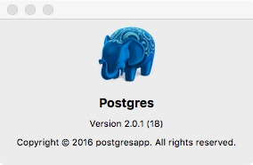

### 장고 설치하기

#### 가상 환경 만들기

장고를 사용할 경우에는 가상 환경을 따로 만들어주는 것이 여러모로 좋습니다. 

파이썬 버전은 일단 3.5로 정해줍니다. 많은 패키지들이 아직 3.6을 지원하지 않습니다. 

> 특히 현재는 PostgreSQL 과 연동하는 패키지가 3.6을 지원하지 않는 것 같습니다.

```
$ conda create --name MY_ENVIRONMENT python=3.5
```

위와 같이 하면 가상 환경이 만들어지고, 아울러 파이썬까지 설치가 됩니다. 

#### 가상 환경에 장고 설치

우선 가상 환경을 활성화 합니다. 

```
$ source activate MY_ENVIRONMENT
```

conda를 이용하여 장고를 설치합니다. 

```
(MY_ENVIRONMENT) ...$ conda install django
```

### 장고 프로젝트 시작하기 

프로젝트를 시작할 폴더로 이동한 다음 다음과 같이 프로젝트를 시작합니다. 

```
(MY_ENVIRONMENT) ...$ cd ...
(MY_ENVIRONMENT) ...$ django-admin.py startproject PROJECT
```

아래와 같이 관련 폴더와 파일들이 생기는 것을 볼 수 있습니다. 

```
(MY_ENVIRONMENT) ...$ tree PROJECT
PROJECT
├── PROJECT
│   ├── __init__.py
│   ├── settings.py
│   ├── urls.py
│   └── wsgi.py
└── manage.py
```

> tree 명령의 설치 및 사용법은 다른 글을 참고하시기 바랍니다.

### 프로젝트 설정 파일 지정하기

#### 데이터베이스 지정하기

장고는 기본적으로 SQLite3 데이터베이스 엔진을 사용하도록 되어 있습니다. 

```
DATABASES = {
    'default': {
        'ENGINE': 'django.db.backends.sqlite3',
        'NAME': os.path.join(BASE_DIR, 'db.sqlite3'),
    }
}
```

PostgreSQL을 사용하려면 공식 문서에 나와 있는 것과 같이 아래처럼 지정해 줍니다. [^djangoproject-databases]

```
DATABASES = {
    'default': {
        'ENGINE': 'django.db.backends.postgresql',
        'NAME': 'mydatabase',
        'USER': 'mydatabaseuser',
        'PASSWORD': 'mypassword',
        'HOST': '127.0.0.1',
        'PORT': '5432',
    }
}
```

위에서 `mydatabase`, `mydatabaseuser`, `mypassword`에는 각각 자신만의 적당한 값으로 치환해서 넣어줍니다.

> 다른 책에서는 `postgresql_psycopg2`를 사용하는데, 공식 문서에는 그냥 `postgresql`을 사용하고 있습니다. 
> 
> 나중에 좀 더 알아봐야겠습니다. 
> 
> 그냥 `postgresql`로 하더라도 psycopg2 패키지는 설치해야하는 것 같습니다. 아래와 같이 **pip** 외에도 **conda**로도 설치할 수 있습니다.
> 
> ```
> $ conda install psycopg2
> ```

PostgreSQL 설정 방법은 프로젝트 설정과는 다른 얘기라서 다음 절에서 따로 설명하도록 합니다. 

#### 템플릿 항목 설정하기

템플릿 항목에서 `'DIRS'` 항목을 아래와 같이 수정합니다. 

```
'DIRS': [os.path.join(BASE_DIR, 'templates')],
```

DIRS 항목은 프로젝트 템플릿 파일이 위치한 디렉토리를 지정합니다. 장고는 프로젝트 템플릿 디렉토리를 애플리케이션 템플릿 디렉토리보다 먼저 검색한다고 합니다. [^book]

> 다만 디폴트로 되어 있지 않다는 것은 꼭 위와 같이 하지 않아도 되는 것이 아닌가라는 생각이 듭니다. 나중에 확인해봐야겠습니다. 

#### 정적 파일 설정하기

`STATIC_URL` 밑에 다음과 같이 추가합니다. 

```
STATIC_URL = '/static/'

STATICFILES_DIRS = [os.path.join(BASE_DIR, 'static')]
```

> 위의 내용도 `load staticfiles`와 관련한 내용일 수 있는데, 확인이 필요합니다. 
> 
> 현재는 `load static`만으로도 충분하다는 얘기도 있는 것 같ㄴ습니다. 

#### 시간대 설정하기

책에는 시간대를 `'UTC'`에서 `'Asia/Seoul'`로 바꾸라고 되어 있는데, 특별한 문제가 없으면 그대로 두겠습니다. 

```
TIME_ZONE = 'UTC' 
``` 

> 어차피 서버 자체가 국내에 없을 경우 상관이 없지 않을까 생각합니다. 
> 
> 이부분도 다시 한 번 정리할 필요가 있습니다. 

#### 미디어 관련 사항 설정하기

파일 업로드 기능을 개발할 때 사용하기 위해 설정 파일 끝에 다음과 같이 지정합니다. 

```
# Media files

MEDIA_URL = '/media/'
MEDIA_ROOT = os.path.join(BASE_DIR, 'media')
```

### PostgreSQL 설정하기

#### PostgreSQL 데이터 베이스 설정하기

일단 Postgres.app 과 pgAdmin을 설치합니다. 설치 방법 등은 다른 글을 참고합니다.

> Postgres.app의 경우 버전이 2로 올라가면서 사용법이 조금 바뀐 것 같습니다. 예전에는 Postgres.app의 쉘에서 db도 생성하고 그랬는데, 이제는 pgAdmin에서 db를 생성해도 상관이 없는 것 같습니다.
> 
> 
> 
> 여튼, Postgres.app 자체에서 뭔가 할 일은 없는 듯 보입니다. 그냥 켜두면 알아서 db 서버 역할을 하는 것 같습니다.  
> 
> 이 부분은 좀 더 익숙해지면 정리하도록 하겠습니다.  

#### pgAdmin 데이터 베이스 설정하기

Postgres.app이 실행되고 있는 상태에서 시작합니다. (아닐 경우 어떻게 되는지는 모릅니다.)

pgAdmin 프로그램의 왼편에 있는 Browser 창의 Servers에서 마우스 오른쪽 버튼을 누르면 메뉴가 뜨는데 여기서 **Create > Server...** 메뉴를 선택하여 `localhost` 서버를 만듭니다. (나중에 확인해 봐야 합니다.)

그러면 localhost가 생기고 하위에 Databases와 Login/Group Roles가 생깁니다.

우선 `Login/Group Roles`에서 **Create > Login/Group Role...** 메뉴를 선택해서 새로운 사용자를 등록합니다. Name과 Password를 적당하게 만들고 Privileges에서 **Can login?** 과 **Superuser**를 Yes로 설정합니다.  

Save를 눌러서 새로운 사용자를 등록합니다.

이제 `Databases`에서 **Create > Database...** 메뉴를 선택해서 새로운 Database를 만듭니다. Database의 **Owner**를 위에 새로 등록한 사용자로 지정합니다. 

Save를 눌러서 새로운 데이터 베이스를 등록합니다. 

### 기본 테이블 생성하기

다음과 같은 명령을 사용해서 기본 테이블을 만들어 줍니다.

```
(MY_ENVIRONMENT) ...$ python manage.py migrate
```

이것은 맨 처음에 사용자 및 권한 그룹 테이블을 데이터베이스에 만들어 주기 위함입니다.

### 관리자 만들기

장고의 Admin 사이트에 로그인하기 위한 관리자(superuer)를 만듭니다.

```
(MY_ENVIRONMENT) ...$ python manage.py createsuperuser
```  

이어서, Username, Email, Password를 각각 입력하면 관리자가 만들어집니다. 

> 참고로 장고 Admin 사이트의 관리자는 PostgeSQL의 관리자와는 전혀 상관이 없습니다. 다만, 같은 정보로 만드는 것은 상관없을 것 같습니다. 

### 웹 서버로 테스트 하기

다음과 같이 웹서버를 실행합니다.

```
(MY_ENVIRONMENT) ...$ python manage.py runserver
```


### 패키지 설치

이어서 내용을 추가합니다.  

### 배포하기

장고걸스 튜토리얼의 [배포하기!](https://tutorial.djangogirls.org/ko/deploy/) 라는 글을 참고하면 좋을 것 같습니다. [^djangogirls-deploy]

### 참고 자료

[^djangogirls-deploy]: [배포하기!](https://tutorial.djangogirls.org/ko/deploy/) : 장고걸스 튜토리얼에 있는 내용입니다. 전체 과정이 상당히 좋은 내용이라 한 번 정도 실습하면 좋을 것 같습니다. 

[^djangoproject-databases]: [Settings - DATABASES](https://docs.djangoproject.com/en/1.10/ref/settings/#databases) : 장고 공식 문서에서 Database 세팅 부분입니다. PostgreSQL 설정 방법은 공식 문서에 예제로 소개되어 있습니다.

[^book]: [파이썬 웹 프로그래밍 실전편]() : 책의 내용입니다.  