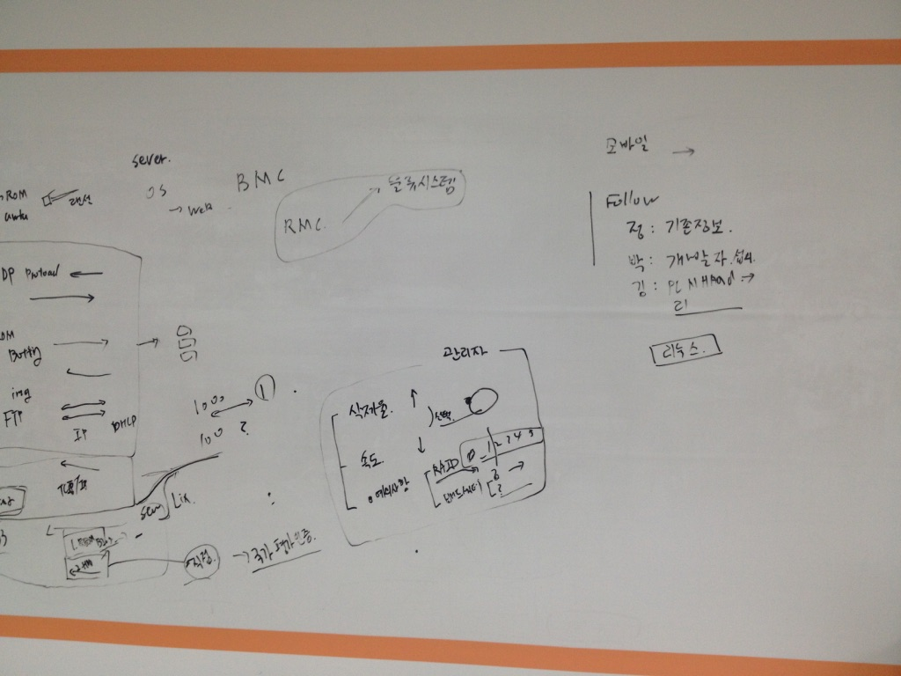

### PXE 

### 기술의 개요

PXE(Preboot Execution Environment)는 엄밀히 말하면 서버 등의 IT 장비가 본격적으로 부팅하기 전에 미리 실행되는 환경이라는 의미를 갖습니다. [^sauru-setup-pxe-master] 하지만 의미가 확장되어 네트워크 인터페이스를 이용해서 컴퓨터를 부팅할 수 있게 만들어주는 환경으로도 이해되는 것 같습니다.  [^joinc-PXEBoot] 이를 이용하면 하드디스크나 CD-ROM 같은 데이터 저장소에 구애받지 않고 운영체제를 설치할 수 있다고 하며, 기술 자체는 1999년에 소개되었다고 합니다. 

PXE는 다음과 같은 기술들을 이용해서 구현한다고 합니다.

1. DHCP : Dynamic Host Configuration Protocol
2. TFTP : Trival File Transfer Protocol
3. IP : Internet Protocol
4. UDP : User Datagram Protocol
5. GUID
6. UUID

PXE Boot는 시스템 관리 이슈로 프로그래머는 굳이 깊이 신경 쓸 필요는 없는 기술이라고 하며, 다만 클라우드를 한다면 반드시 알아야 하는 기술이라고 합기도 합니다. 이것은 자동화의 가장 첫 단계가 PXE를 이용한 운영체제의 설치이기 때문입니다. 

PXE Boot를 하면 `kickstart`도 자연스럽게 따라옵니다.

#### 구축 환경

PXE Boot 환경을 구축하기 위해서는 PXE 서버와 PXE 클라이언트 최소 2대의 노드가 필요합니다.

* PXE 서버

	PXE 클라이언트에게 원격 부팅 및 운영체제 인스톨 환경을 제공하는 컴퓨터 노드입니다.
* PXE 클라이언트

	운영체제를 설치하고자 하는 모든 컴퓨터입니다. 메인보드가 PXE를 지원하면 되는데, 요즘은 거의 모든 메인보드가 PXE를 지원하니 걱정할 것 없습니다. 메인보드 외에도 네트워크 장치를 통한 PXE 부팅을 할 수 있는데, 이는 네트워크 카드(Network Interface Card)-보통 그냥 랜카드라고 부르는 것을 말하는 것 같습니다-에 존재한다고 합니다.
	
PXE는 일종의 Boot Loader로, NIC 안에 살고 있다. 모든 Boot Loader의 핵심 임무는 단 하나이다. 바로, “실제로 이 서버의 주인이 될 OS의 Kernel을 찾아 읽어서 Memory에 올려주는 일“이 그것이 라고 합니다.

#### 운영체제 설치 파일 저장소 준비

#### TFTP 서버 설정

#### DHCP 설정

#### PXE 클라이언트 테스트

#### Kickstart

CentOS에서 운영체제 설치를 자동화해주는 도구인 것 같습니다.

### 회의 자료

### 네트워크 부팅 

#### PXE 구성하기

다음과 같은 자료들이 있습니다. 

[^sauru-setup-pxe-master]: [Howto: PXE Master 구성하기](http://www.sauru.so/blog/setup-pxe-master/)
* [Howto: PXE 부팅 설정 (HP DL Series)](http://www.sauru.so/blog/config-pxe-options/)
* [pxe booting: 처음부터 시작하는 pxe 부팅](http://egloos.zum.com/dukuduku/v/6442770)
* [리눅스: PXE, KICKSTART ( 네트워크 부팅 , 리눅스 자동설치)](http://onecellboy.tistory.com/231)

#### 기타 자료

다음과 같은 자료들이 있습니다. 

* [네트워크 부팅과 Etherboot에 관한 소개](http://www.linuxlab.co.kr/docs/98-12-1.htm)
* [4.3. TFTP 네트워크 부팅에 필요한 파일 준비하기](https://www.debian.org/releases/lenny/arm/ch04.html.ko)

### 참고 자료

[Howto: PXE Master 구성하기](http://www.sauru.so/blog/setup-pxe-master/)

[Howto: PXE 부팅 설정 (HP DL Series)](http://www.sauru.so/blog/config-pxe-options/)

[Blancco Cloud](https://cloud.blancco.com/login)

[네트워크 부팅과 Etherboot에 관한 소개](http://www.linuxlab.co.kr/docs/98-12-1.htm)

[4.3. TFTP 네트워크 부팅에 필요한 파일 준비하기](https://www.debian.org/releases/lenny/arm/ch04.html.ko)

[리눅스: PXE, KICKSTART ( 네트워크 부팅 , 리눅스 자동설치)](http://onecellboy.tistory.com/231)

[^joinc-PXEBoot]: [PXE](https://www.joinc.co.kr/w/Site/System_management/PXEBoot) : 내용도 잘 정리되어 있고, 사이트 자체도 대단히 잘 만든 것 같습니다. 전체 사이트를 참고할만한 것 같습니다.
